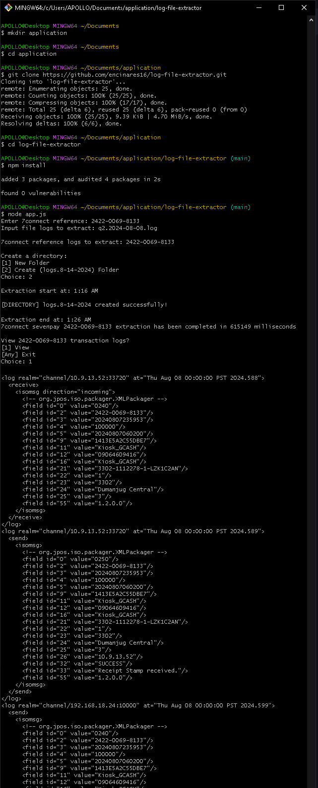

# 7connect Log Extractor

This guide will walk you through the steps to clone a repository, install dependencies, and run the application.

## Prerequisites

- **Node.js** (version 14 or later recommended)
- **Git**


# Steps

**1. Run Git Bash**

   Open any folder, right-click, select **Open Git Bash Here** and type the following command on the terminal.

Create a directory
   
```cmd
mkdir application
```

  Go to application directory

```cmd
cd application
```

**2. Clone the project and install dependencies**

   To clone the project, and install dependencies, type the following commands

```bash
git clone https://github.com/encinares16/log-file-extractor.git
```

```bash
cd log-file-extractor
```

Installing dependencies

```bash
npm install
```

**3. Run the application**

1. Extract specific LOG file (e.g. q2.2024-08-08.log) and move inside log-file-extractor directory.
2. Have specific seven pay id (e.g. 2422-0069-8133)

Run the application, type

```bash
node app.js
```

Then input, 
```cmd
Enter 7connect reference: 2422-0069-8133
Input log file to extract: q2.2024-08-08.log
Create new directory, choice: 2
View transaction logs, choice: 1
```


Screenshot Guide




